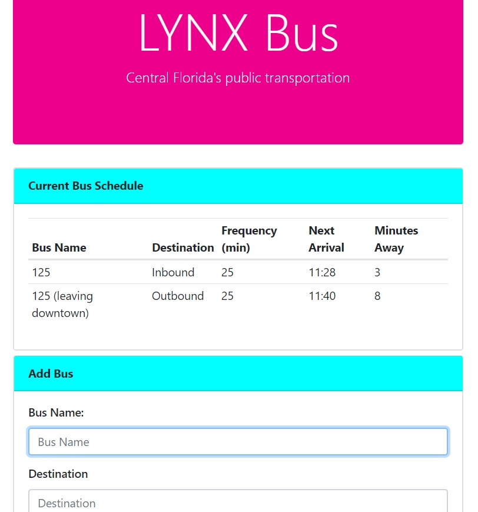

# TrainSchedule
## LYNX Bus Schedule
------
## Description
This app allows users to input data about bus routes and gives them real time data about when the next bus is scheduled to arive.  It also shows users the bus routes that other users have already stored.
------
## Technology Used
This app was written with HTML5, Bootstrap 5.3.0, CSS3, JavaScript, jQuery 3.3.1, moment.js, and firebase.
------
## Screenshot
